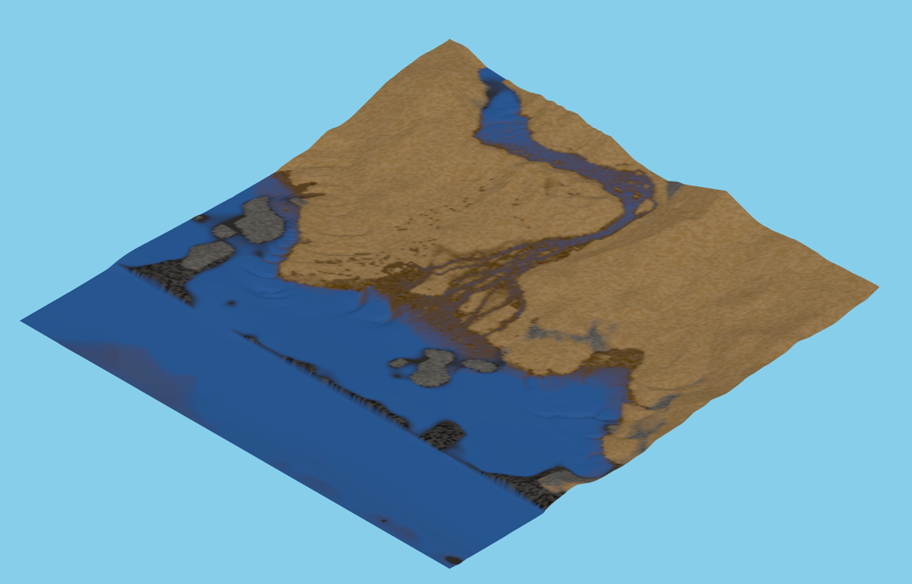

# Sandcastles

A 2.5D isometric beach sandbox. Dig sand, build dams, divert streams, and watch waves reshape the shore.



## Running

```bash
npm install
npm run dev
```

Then open the local URL Vite prints. No build step needed for development.

## Controls

| Key / gesture | Action |
|---|---|
| `S` | Spade (dig sand into bucket) |
| `D` | Toggle between Spade and Dump |
| `W` | Water stream (click a cell to place a source) |
| `R` | Reset all water and stream sources |
| `L` | Toggle the Look tool (per-cell readout) |
| `?` | Toggle controls overlay |
| Pinch | Zoom |
| Two-finger drag | Pan |

Click any cell to apply the active tool.

## What's been built

### Terrain (M1)

A 256×256 grid rendered as a single deformable Three.js mesh. The beach slopes from a high sandy dune at the back down to a flat sea at the front. An isometric orthographic camera supports pinch-to-zoom and two-finger pan. Raycasting maps pointer events onto grid cells.

### Bucket and spade tools (M2)

A `Bucket` carries up to 10 units of sand. The Spade tool digs one unit per click from any diggable cell (sand, gravel, pebble — not rock). Dump places one unit back. The HUD shows the current tool and bucket fill level.

### Water flow (M3)

A shallow-water simulation runs at 30 Hz. Water moves across staggered edges between cells, accelerating down the free-surface gradient and scaled by the depth it is moving through — so waves travel at `√(g·h)`, quick in deep water and slow in the shallows. Volume is conserved exactly. Bed friction is Manning's, which leaves deep water almost undamped while a thin swash sheet slows quickly. Streams are continuous sources placed with the `W` tool. The terrain mesh raises its vertices by the local water height so the water surface is part of the geometry.

### Dams and lakes (M4)

Water obeys the same terrain it flows over, so a ridge of sand naturally dams a stream and a lake fills behind it. Each sim (water, erosion, moisture, slope, waves, sponge) returns a per-cell dirty mask; these are combined and used to limit mesh updates to only the cells that actually changed that tick, instead of rebuilding all 65,536 vertices every tick. The `R` key resets all water and stream sources.

### Erosion and wet/dry sand (M5)

- **Erosion** — each cell has a sediment capacity proportional to flow velocity. Fast water picks up sand; slow water deposits it. The bed is limited in how fast it may move: unbounded, scour deepens a channel, the channel speeds the water, and the faster water scours harder until the sim tears itself apart.
- **Moisture** — cells adjacent to water become wet (darker colour); moisture diffuses and evaporates over time.
- **Slope stability** — sand above 20° angle of repose slumps toward lower neighbours, conserving volume. Towers collapse; dams hold their shape.

### Waves and tide (M6)

Swell is driven in at the seaward edge, arriving every 2 seconds at 30° off square-on. Nothing pushes it up the beach — it travels there itself, and because wave speed follows `√(g·h)` it does what real swell does on the way: slows and grows as the floor shallows, and bends to face the shore. A sponge layer over the outermost rows soaks up the backwash so nothing bounces off the edge of the world.

The sea is simulated across its full width rather than held flat, so the tide arrives by genuinely filling and draining it through that edge, over a 3-minute cycle. The HUD shows the current sea level and a countdown to the next crest.

### Polish (M7)

- Per-cell colour noise (a stable position hash) breaks up the flat sand surface.
- Wet sand blends toward a darker colour based on moisture level.
- A short filtered-noise audio burst plays through the Web Audio API when each wave hits.
- Press `?` for a full in-game controls reference.

## Architecture

```
src/
├── audio/
│   └── WaveAudio.ts        Web Audio API wave splash
├── core/
│   ├── Bucket.ts           Bucket data model
│   ├── Game.ts             Fixed-timestep loop, input routing, HUD
│   ├── Grid.ts             256×256 Float32Array terrain data
│   └── materials.ts        Material constants and properties
├── input/
│   ├── LookInfo.ts         Per-cell readout for the Look tool
│   ├── Picker.ts           Raycast → grid cell
│   └── Tools.ts            Dig / dump pure functions
├── render/
│   ├── IsoCamera.ts        Orthographic isometric camera
│   ├── Renderer.ts         Three.js scene, lighting, shadows
│   ├── TerrainMesh.ts      Deformable mesh with partial vertex updates
│   ├── cellNoise.ts        Position-hash colour jitter
│   ├── groundColour.ts     Sand-over-rock blend by sand depth
│   ├── isoProjection.ts    Iso angles and world → screen direction
│   ├── rockColour.ts       Moisture-blended rock colour
│   ├── sandColour.ts       Moisture-blended sand colour
│   └── waterColour.ts      Depth-blended water over the ground beneath
└── sim/
    ├── combineDirty.ts     OR-combines per-sim dirty masks
    ├── Erosion.ts          Sediment capacity erosion model
    ├── Moisture.ts         Wet/dry diffusion and evaporation
    ├── Slope.ts            Talus / angle-of-repose slumping
    ├── Sponge.ts           Absorbing layer at the seaward boundary
    ├── Tide.ts             Slow sea-level oscillation
    ├── WaterSim.ts         Staggered-grid shallow water
    └── Waves.ts            Swell driver at the seaward boundary
```

All simulation state lives in typed `Float32Array` buffers. The sim runs on the main thread at 30 Hz and takes about a third of that budget; rendering runs at 60 fps. The architecture keeps a clear path to move the sim into a Web Worker if profiling demands it.

## Tests

201 tests across 22 files, all passing:

```bash
npm test
```

Tests cover every simulation system (water, erosion, moisture, slope, waves, sponge, tide) and rendering utilities (sand colour, cell noise, iso projection) as pure-function unit tests with no DOM or WebGL dependency.
