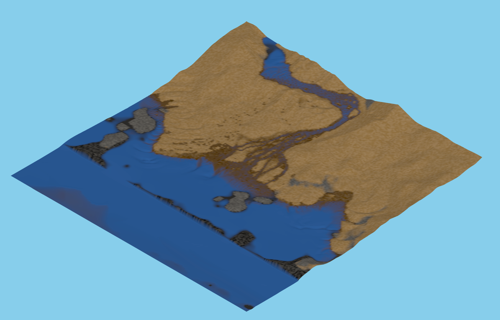

# Sandcastles

A 2.5D isometric beach sandbox. Dig sand, build dams, divert streams, and watch waves reshape the shore.



## Running

```bash
npm install
npm run dev
```

Then open the local URL Vite prints. No build step needed for development.

## Controls

| Key / gesture | Action |
|---|---|
| `S` | Spade (dig sand into bucket) |
| `D` | Dump (pour sand back) |
| `W` | Water stream (click a cell to place a source) |
| `R` | Reset all water and stream sources |
| `P` | Pause / resume the simulation |
| `L` | Toggle the Look tool (per-cell readout) |
| `?` | Toggle controls overlay |
| Pinch | Zoom |
| Two-finger drag | Pan |

Click any cell to apply the active tool.

**Export** and **Import** are buttons in the toolbar. Export writes the whole
beach to a JSON file and is offered only while the simulation is paused, so the
file is the beach you can see. Import asks before replacing what you have.

## What's been built

### Terrain (M1)

A 256×256 grid rendered as a single deformable Three.js mesh. The beach slopes from a high sandy dune at the back down to a flat sea at the front. An isometric orthographic camera supports pinch-to-zoom and two-finger pan. Raycasting maps pointer events onto grid cells.

### Bucket and spade tools (M2)

A `Bucket` carries up to 1000 units of sand. The Spade tool digs up to 100 units per click from any diggable cell (sand, gravel, pebble — not rock); Dump places 10 back. The toolbar shows the selected tool, the bucket's fill level, a countdown to the next wave, and the current sea level.

### Water flow (M3)

A shallow-water simulation runs at 30 Hz. Water moves across staggered edges between cells, accelerating down the free-surface gradient and scaled by the depth it is moving through — so waves travel at `√(g·h)`, quick in deep water and slow in the shallows. Volume is conserved exactly. Bed friction is Manning's, which leaves deep water almost undamped while a thin swash sheet slows quickly. Streams are continuous sources placed with the `W` tool, each pouring water in at a modest fixed rate — enough to cut a channel through the sand without flooding the beach. The terrain mesh raises its vertices by the local water height so the water surface is part of the geometry.

### Dams and lakes (M4)

Water obeys the same terrain it flows over, so a ridge of sand naturally dams a stream and a lake fills behind it. Each sim (water, drying, erosion, moisture, slope, waves, sponge) returns a per-cell dirty mask; these are combined and used to limit mesh updates to only the cells that actually changed that tick, instead of rebuilding all 65,536 vertices every tick. The `R` key resets all water and stream sources.

### Erosion and wet/dry sand (M5)

- **Erosion** — each cell has a sediment capacity set by stream power: how fast the water moves *and* how steeply it is running downhill. Water carrying more sand than its capacity deposits the surplus; water carrying less picks sand up. The slope term is what makes it a river rather than a sheet wash — speed alone cannot tell the two apart, since a thin film racing over flat ground moves as fast as the deepest thread, so without it every wet cell scours alike and the stream planes a wide flat valley. With it, water gathering into a channel finds a steeper surface there than over the ground either side, cuts harder for it, and the channel deepens instead of widening. The bed is also limited in how fast it may move: unbounded, scour deepens a channel, the channel speeds the water, and the faster water scours harder until the sim tears itself apart.
- **Moisture** — cells adjacent to water become wet (darker colour); moisture diffuses and evaporates over time.
- **Drying** — once wet, a cell used to stay wet forever: Manning friction glues a thin film down by its own bed drag, so drainage asymptotes and never finishes, and the water column had no other sink. Below a film depth the water now drains at a constant rate and clamps to zero — a *linear* sink reaches zero in finite time where the drainage law cannot. Gated on depth, so the sea and real puddles are untouched.
- **Slope stability** — sand above its 32° angle of repose (the real value for dry sand) slumps toward lower neighbours, conserving volume. Towers collapse; dams hold their shape. This is also the dominant control on how wide an eroded channel ends up: too shallow an angle and the banks slump back as fast as the stream cuts them, spreading the river into a flat sheet.

### Waves and tide (M6)

Swell is driven in at the seaward edge, arriving every 2 seconds at 30° off square-on. Nothing pushes it up the beach — it travels there itself, and because wave speed follows `√(g·h)` it does what real swell does on the way: slows and grows as the floor shallows, and bends to face the shore. A sponge layer over the outermost rows soaks up the backwash so nothing bounces off the edge of the world.

The sea is simulated across its full width rather than held flat, so the tide arrives by genuinely filling and draining it through that edge, over a 3-minute cycle. The HUD shows the current sea level and a countdown to the next crest.

### Polish (M7)

- Per-cell colour noise (a stable position hash) breaks up the flat sand surface.
- Wet sand blends toward a darker colour based on moisture level.
- Press `?` for a full in-game controls reference.

The game is silent for now. `WaveAudio` is written and works — a filtered-noise burst through the Web Audio API — but nothing is wired to it. It used to fire on every crest, which was fine at one wave every 20 seconds and relentless once the swell period came down to 2. What it wants is a trigger tied to something that actually happens, a wave breaking rather than a crest passing, and that does not exist yet.

### Surviving a restart (M8)

Chrome discards backgrounded tabs under memory pressure, and a discarded tab reloads from scratch — which used to cost the whole beach. The game now snapshots itself every 5 seconds and the moment the tab is backgrounded, into IndexedDB. Restoration is exact, including tide and swell phase, so a resumed game is indistinguishable from an uninterrupted one.

`visibilitychange` is the trigger that does the work: Chrome only discards a tab that is already hidden, so it fires minutes before the freeze. `pagehide` and `freeze` are async writes against a page that may already be going away, so they can only ever be best-effort, and the periodic save is what covers a crash.

Storage holds the eight `Float32Array` layers directly — IndexedDB structured-clones typed arrays natively, so there is no serialisation format to write. Exactly 2.00 MiB, which rules out `localStorage` on both size and its string-only, main-thread API.

### Export and import (M9)

The whole beach can be written to a JSON file and read back, so a world can outlive the browser profile it was made in. The eight cell layers travel as base64 rather than JSON numbers: 2.80 MB against roughly 5 MB, and bit-exact where rounding for readability would round away the sediment columns and the drying film.

Export is offered only while the simulation is paused, so the file is the beach the player can see. Import is not gated that way, but asks before replacing — there is no undo. An imported file is held to exactly the guard a stored save is, so anything unreadable, stale or corrupt is refused with a message rather than half-loaded.

## Architecture

```
src/
├── main.ts                 Loads any saved beach, then starts the game
├── types.ts                Shared coordinate types
├── audio/
│   └── WaveAudio.ts        Web Audio API wave splash (not currently wired up)
├── core/
│   ├── AutoSaver.ts        Decides when a snapshot gets written
│   ├── Bucket.ts           Bucket data model
│   ├── Game.ts             Fixed-timestep loop, input routing, HUD
│   ├── GameFile.ts         Exported file shape, parsing, download name
│   ├── GameSnapshot.ts     Snapshot shape, guard, create and apply
│   ├── Grid.ts             256×256 Float32Array terrain data
│   ├── IndexedDbSnapshotStore.ts  The IndexedDB store itself
│   ├── SimClock.ts         Fixed-timestep accumulator
│   ├── SnapshotStore.ts    Storage interface the game codes against
│   ├── base64Cells.ts      Cell layers to base64 and back
│   ├── downloadFile.ts     Blob download plumbing
│   └── materials.ts        Material constants and properties
├── input/
│   ├── KeyBindings.ts      Key → tool
│   ├── LookInfo.ts         Per-cell readout for the Look tool
│   ├── Picker.ts           Raycast → grid cell
│   ├── Toolbar.ts          Tools, pause, look, reset, export, import, readouts
│   └── Tools.ts            Dig / dump pure functions
├── render/
│   ├── IsoCamera.ts        Orthographic isometric camera
│   ├── Renderer.ts         Three.js scene, lighting, shadows
│   ├── TerrainMesh.ts      Deformable mesh with partial vertex updates
│   ├── cellNoise.ts        Position-hash colour jitter
│   ├── groundColour.ts     Sand-over-rock blend by sand depth
│   ├── isoProjection.ts    Iso angles and world → screen direction
│   ├── rockColour.ts       Moisture-blended rock colour
│   ├── sandColour.ts       Moisture-blended sand colour
│   └── waterColour.ts      Depth-blended water over the ground beneath
└── sim/
    ├── Drying.ts           Thin-film sink so wet ground can dry out
    ├── Erosion.ts          Stream-power sediment capacity model
    ├── Moisture.ts         Wet/dry diffusion and evaporation
    ├── Slope.ts            Talus / angle-of-repose slumping
    ├── Sponge.ts           Absorbing layer at the seaward boundary
    ├── Tide.ts             Slow sea-level oscillation
    ├── WaterSim.ts         Staggered-grid shallow water
    ├── Waves.ts            Swell driver at the seaward boundary
    └── combineDirty.ts     OR-combines per-sim dirty masks
```

All simulation state lives in typed `Float32Array` buffers — eight of them, exactly 2.00 MiB, which is also what gets saved and exported. The sim runs on the main thread at 30 Hz and takes about a third of that budget; rendering runs at 60 fps. The architecture keeps a clear path to move the sim into a Web Worker if profiling demands it.

## Tests

339 tests across 32 files, all passing:

```bash
npm test
```

Most are pure-function unit tests over the simulation systems (water, drying, erosion, moisture, slope, waves, sponge, tide) and the rendering utilities (sand colour, cell noise, iso projection), with no DOM or WebGL involved.

The rest run under jsdom, where a DOM is genuinely part of the behaviour: the toolbar's buttons and their enabled state, the camera, the IndexedDB store against `fake-indexeddb`, and the save/restore and export/import round trips driven through real components. `Game` itself has no unit tests — it cannot be constructed without WebGL — so everything with a decision in it lives outside it, and what remains is assembly verified in the browser.
